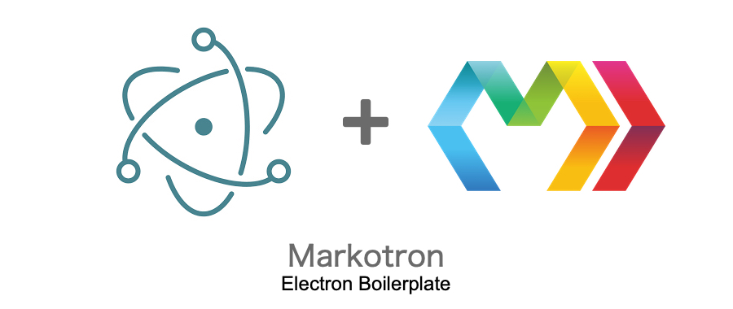
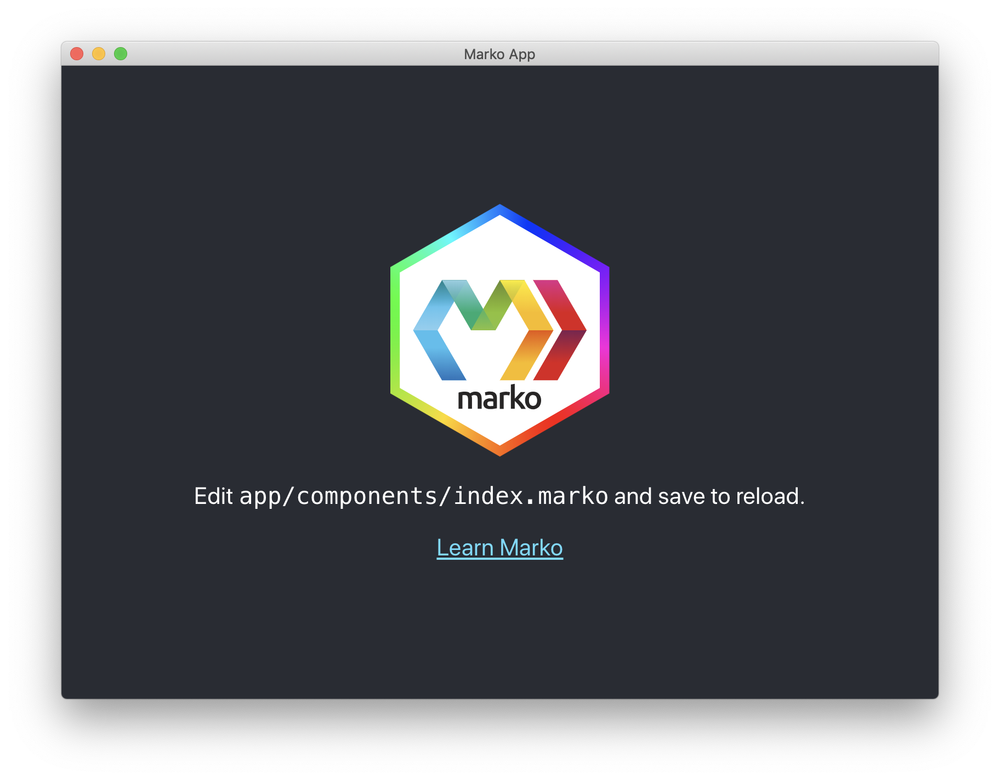

<p align="center">
	
	<span>with Marko & Webpack.</span>
</p>



```shell
# Clone Repository
$ git clone https://github.com/Teddy95/markotron.git my-project

# Go into root directory
$ cd my-project

# Install dependencies
$ npm install

# Compile & run App...
$ npm run build
$ npm run start

# ...or run App in dev mode
$ npm run dev
```

- Live reloading of web contents in all browser windows after filechanges :fire: :dizzy:
- Compiling Marko components including Html, Js & Css and bundle it with Webpack :crystal_ball:
- Included Electron Packager configurations for packaging application for Mac OS X, Windows and Linux :wine_glass: :gift:

Happy Coding! :heart: :sparkles:

## File structure

### Development in `/app`

- `/app` Electron index.html & main.js
- `/app/assets` Logos, images, icons, ...
- `/app/components` Marko components
- `/app/lib` JavaScript files / libraries
- `/app/style` CSS / SCSS Stylesheets
- `/app/view` Marko.js views for the windows

### Production in `/dist`

- `/dist` App compiled from `/app`

### Packaging in `/release`

- `/release` Compiled applications for Mac OS X, Windows and Linux

## Scripts

### Start App

```shell
$ npm run start
```

### Start App in dev mode

```shell
# Recompile app after file changes and reload contents in Electron

$ npm run dev
```

### Build App

Compile application and generate `/build` directory.

```shell
$ npm run build
```

### Release App

##### Configurations

Set product name & icons in `package.json`.

```json
{
	"name": "markotron",
	"productName": "Markotron - Electron Boilerplate",
	"build": {
		"icon": {
			"mac": "resources/icons/icon.icns",
			"windows": "resources/icons/icon.ico",
			"linux": "resources/icons/icon.png"
		}
	}
}
```

##### Packaging

```shell
# Packaging for Mac OS X
$ npm run package-mac

# Packaging for Linux
$ npm run package-linux

# Packaging for Windows
$ npm run package-windows

# ...or release it all at once
$ npm run release
```
