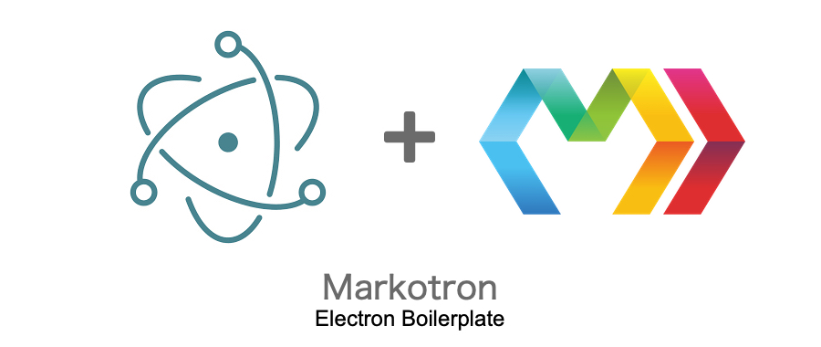
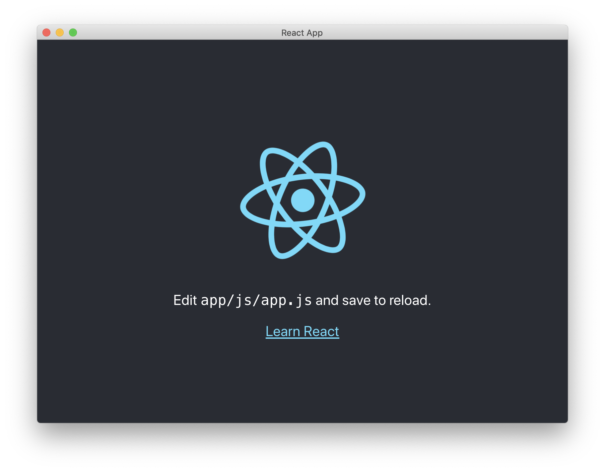

<p align="center">
	
	<span>with Marko, Webpack and Gulp.</span>
</p>



```shell
# Begin with installing Gulp!
$ npm install gulp -g

# Clone Repository
$ git clone https://github.com/Teddy95/markotron.git my-project

# Go into root directory
$ cd my-project

# Install dependencies
$ npm install

# Compile & run App...
$ npm run build
$ npm start

# ...or run App in dev mode
$ npm run dev
```

- Live reloading of web contents in all browser windows after filechanges :fire:
- Watch task for live compiling of Sass/Scss and Marko files after changes :dizzy:
- Compiling Marko components including Html, Js & Css and bundle it with Webpack :crystal_ball:
- Gulp included + Tasks for compiling, packaging & more :wine_glass:
- Included Electron Packager configurations for packaging application for Mac OS X, Windows and Linux :gift:

Happy Coding! :heart: :sparkles:

## File structure

### Development in `/app`

- `/app` Electron index.html & main.js
- `/app/assets` Logos, images, icons, ...
- `/app/components` Marko components
- `/app/css` Your Css files
- `/app/js` Your Js files
- `/app/sass` Your Sass/Scss files

### Production in `/build`

- `/build` Electron index.html & main.js copied from `/app`
- `/build/assets` Files copied from `/app/assets`
- `/build/css` Here you find the `style.min.css` generated from all Css files in `/app/css`
- `/build/js` Here you find the `scripts.min.js` generated from all Js files in `/app/js` & the `bundle.min.js` which contains the Js code of your Marko application

### Packaging in `/release`

- `/release` Compiled applications for Mac OS X, Windows and Linux

## Scripts

### Start App

```shell
$ npm start
```

### Start App in dev mode

```shell
# 1. Compile Sass/Scss & Jsx
# 2. Build application
# 3. Start `gulp watch` for recompiling Sass/Scss & Jsx after filechanges
# 4. Start Electron

$ npm run dev
```

### Watch Scripts

Watching the following scripts and compile they, if there were changes.

```
app/assets/**/*
app/components/**/*
app/sass/*.scss
app/css/*.css
app/js/*.js
app/*.html
app/*.js
```

```shell
$ npm run watch
```

### Build App

Compile application and generate `/build` directory.

```shell
$ npm run build
```

### Release App

##### Configurations

Set product name & icons in `package.json`.

```json
{
	"name": "markotron",
	"productName": "Markotron - Electron Boilerplate",
	"build": {
		"icon": {
			"mac": "build/assets/icons/icon.icns",
			"windows": "build/assets/icons/icon.ico",
			"linux": "build/assets/icons/icon.png"
		}
	}
}
```

##### Install Electron Packager

```shell
$ npm install electron-packager -g
```

##### Packaging

_Packaging for Mac OS X_:

```shell
$ npm run build
$ npm run package-mac
```

_Packaging for Windows_:

```shell
$ npm run build
$ npm run package-windows
```

_Packaging for Linux_:

```shell
$ npm run build
$ npm run package-linux
```

...or release it all at once:

```shell
$ npm run release
```
